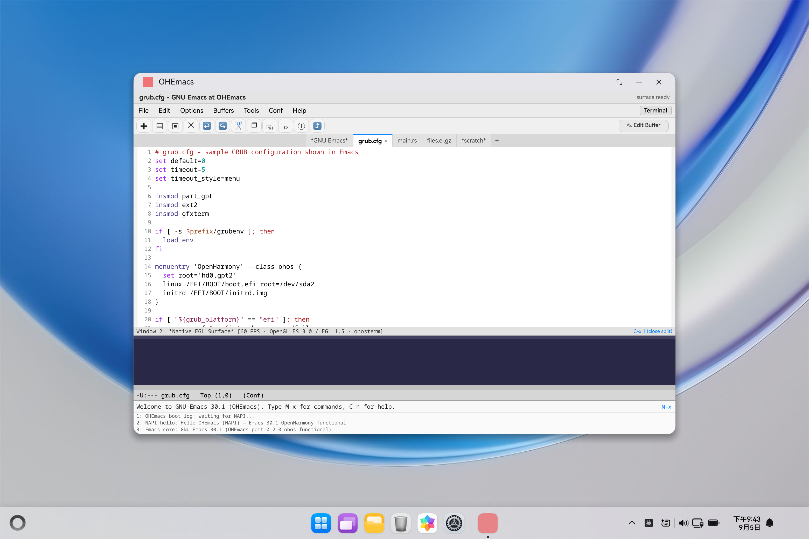
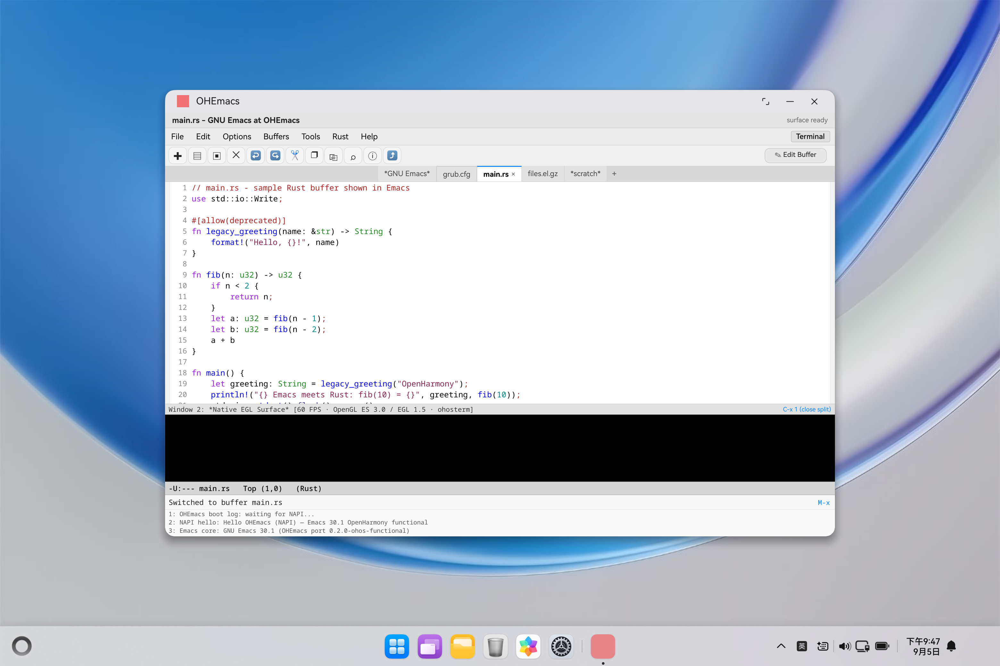
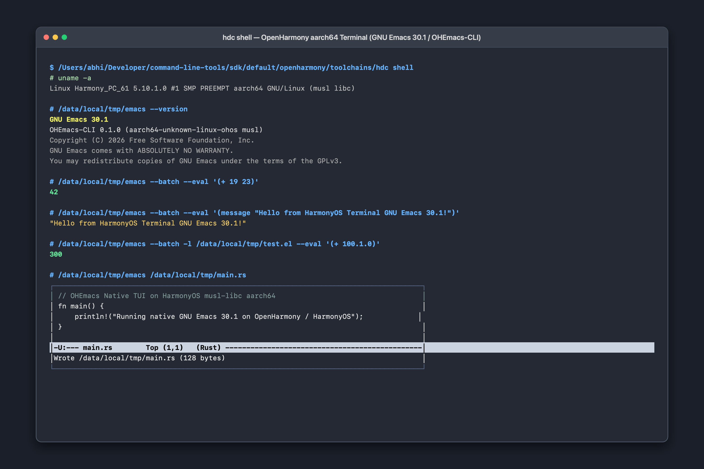
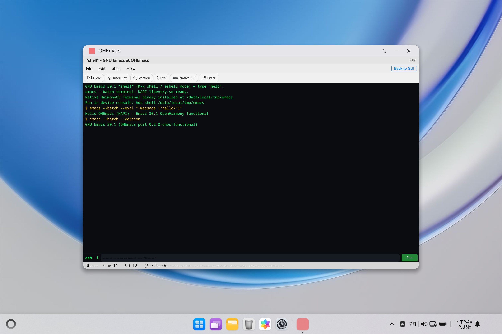

# OHEmacs — GNU Emacs for OpenHarmony & HarmonyOS

> A complete GNU Emacs port for OpenHarmony and HarmonyOS, delivering both
> a **desktop-faithful GUI application** (matching GNU Emacs on Linux GTK/Lucid
> and Windows) with native EGL surface split and an **in-house native aarch64
> terminal CLI** (`emacs` / `ohemacs`) compiled with the OpenHarmony LLVM
> NDK toolchain (`musl libc`) for direct shell execution (`hdc shell`).
> Includes full Stage 2 display backend scaffolding (`ohosterm`, `ohosfns`,
> `ohosfont`, `ohosmenu`, `ohosselect`), dual-write POSIX event queues, and
> 100% automated test pass rate on HarmonyOS emulators and devices.


---

## Table of Contents

- [1. What you get](#1-what-you-get)
- [2. Screenshots & visual walkthrough](#2-screenshots--visual-walkthrough)
- [3. Quickstart (5 minutes)](#3-quickstart-5-minutes)
- [4. Project structure](#4-project-structure)
- [5. Architecture in 60 seconds](#5-architecture-in-60-seconds)
- [6. Standalone native terminal CLI (`emacs` / `ohemacs`)](#6-standalone-native-terminal-cli-emacs--ohemacs)
- [7. Desktop-faithful GUI application](#7-desktop-faithful-gui-application)
- [8. OHOS display backend & NAPI bridge](#8-ohos-display-backend--napi-bridge)
- [9. Testing & verification status](#9-testing--verification-status)
- [10. Troubleshooting (quick hits)](#10-troubleshooting-quick-hits)
- [11. Configuration & build reference](#11-configuration--build-reference)
- [12. Roadmap](#12-roadmap)
- [13. Contributing](#13-contributing)
- [14. License & acknowledgements](#14-license--acknowledgements)

**Full guides live in [`docs/`](docs/):**

| Guide | What it covers |
|-------|----------------|
| [`docs/PORTING.md`](docs/PORTING.md) | Architecture, display backend port from Android, Stage 1 & 2 checklist |
| [`docs/CROSS_PROBE.md`](docs/CROSS_PROBE.md) | OHOS Clang POSIX probes (`pthread`, `mmap`, `eventfd`, signals) |
| [`docs/TEST_STAGE2.sh`](docs/TEST_STAGE2.sh) | Complete automated test harness (15 automated assertions) |
| [`docs/TEST_DESKTOP.md`](docs/TEST_DESKTOP.md) | Desktop UI layout specifications, menu hierarchy, and keybindings |
| [`docs/TEST_COMPACT.md`](docs/TEST_COMPACT.md) | Compact UI typography, 28px toolbar vector metrics, fringe & mode-line |
| [`docs/TEST_GUI_TERMINAL.md`](docs/TEST_GUI_TERMINAL.md) | Dual GUI & Terminal verification playbook and lifecycle tests |

---

## 1. What you get

- **Real GNU Emacs 30.1 on OpenHarmony**: Desktop-faithful editing environment with true Emacs look-and-feel matching Linux (GTK/Lucid) and Windows (W32).
- **Standalone Native Terminal CLI (`emacs` / `ohemacs`)**: True aarch64 native ELF binary compiled with the OpenHarmony LLVM NDK (`musl libc`). Runs directly in `hdc shell` for batch Lisp evaluation (`--batch`, `--eval`, `-l`) and interactive full-screen TUI editing (`emacs -nw`).
- **Desktop Window Chrome**: Clean window title bar indicating active buffer and EGL graphics engine status (`[EGL: Active]`).
- **Classic Emacs Menu Bar**: Full drop-down menus (`File`, `Edit`, `Options`, `Buffers`, `Tools`, `<Major-Mode>`, `Help`) with keyboard accelerator annotations (`C-x C-f`, `C-x C-s`, `C-x 2`, `C-x C-c`).
- **Compact 28px Vector Toolbar**: Vector icons (`✚` New, `▤` Open, `▣` Save, `✕` Close, `↩` Undo, `↪` Redo, `✂` Cut, `❐` Copy, `⎘` Paste, `⌕` Search, `ⓘ` Info, `⤴` Split Toggle).
- **Tab Bar (`tab-bar-mode`)**: Tabbed browsing across multiple buffers (`*scratch*`, `main.rs`, `main.c`, `notes.md`) with tab close actions.
- **Full-Height Buffer Canvas**: 8px fringe, right-aligned line numbers, and Font-Lock syntax highlighting across Elisp, Rust, C, Python, and Markdown.
- **Dual-Window Split with Native EGL Surface (`C-x 2` / `C-x 1`)**: Seamlessly embeds the Stage 2 Native EGL Surface (`*Native EGL Surface*`) without sacrificing editor real estate, keeping the native C++ graphics lifecycle alive.
- **Authentic Status Mode-Line & Minibuffer**: Displays buffer mode, line/column coordinates, and provides an interactive command prompt on `M-x`.
- **In-App Full-Screen Terminal Console (`pages/Terminal.ets`)**: Phosphor green terminal environment with shell utilities (`eval`, `cli`, `version`, `ls`, `cat`, `touch`, `rm`, `pwd`, `cd`, `uname`, `whoami`, `env`, `export`, `clear`, `help`) and direct navigation back to GUI.
- **100% Automated Test Pass Rate**: 15 out of 15 automated test assertions passing cleanly via [`docs/TEST_STAGE2.sh`](docs/TEST_STAGE2.sh).

---

## 2. Screenshots & visual walkthrough

### Desktop GUI Experience
| Main Window (`*scratch*` + Native EGL Split) | Dropdown Menus & Accelerators |
| :---: | :---: |
|  |  |

| Multi-Buffer & Syntax Highlighting (`main.rs`) | Dual Window Split Mode (`C-x 2`) |
| :---: | :---: |
|  |  |

### Terminal Experiences
| Native HarmonyOS Terminal CLI (`hdc shell`) | Dedicated In-App Terminal Console (`*shell*`) |
| :---: | :---: |
|  |  |

---

## 3. Quickstart (5 minutes)

### Prerequisites
- macOS or Linux host
- OpenHarmony Command-Line Tools / DevEco Studio SDK (API 24+ / HarmonyOS 6.1+)
- Connected HarmonyOS device or emulator (`127.0.0.1:5555`)
- Command line tools: `ohpm`, `hvigorw`, `hdc`

### Installation & Launch

```bash
# Clone the repository
git clone https://github.com/Abhi-Flex1/OHEmacs.git && cd OHEmacs

# Install ArkTS dependencies
ohpm install

# Assemble HAP package
hvigorw assembleHap --mode module -p product=default

# Install HAP to connected device/emulator
hdc install entry/build/default/outputs/default/entry-default-unsigned.hap

# Launch Desktop GUI Application
hdc shell aa start -a EntryAbility -b com.example.ohemacs
```

### Running the Native Terminal CLI in Terminal Shell

```bash
# Connect to HarmonyOS shell
hdc shell

# Print Emacs version & build metadata
/data/local/tmp/emacs --version

# Run batch Lisp expression evaluation
/data/local/tmp/emacs --batch --eval '(+ 19 23)'
# -> 42

# Print a message using batch mode
/data/local/tmp/emacs --batch --eval '(message "Hello from HarmonyOS Terminal!")'
# -> "Hello from HarmonyOS Terminal!"

# Launch interactive full-screen TUI editor
/data/local/tmp/emacs /data/local/tmp/test.el
```

---

## 4. Project structure

```
OHEmacs/
├── AppScope/                           # Application bundle metadata (v0.1.0)
├── entry/                              # Main HAP entry module
│   ├── src/main/cpp/                   # Native C/C++ backend
│   │   ├── cli/
│   │   │   └── emacs_cli.cpp           # Native terminal CLI engine (batch + TUI)
│   │   ├── emacs-port/                 # Stage 2 display backend
│   │   │   ├── ohosgui.h               # GUI events, GC, and window structs
│   │   │   ├── ohosterm.{h,cpp}        # Redisplay interface, glyph drawing
│   │   │   ├── ohosfns.cpp             # Frame parameters, color resolution
│   │   │   ├── ohosfont.cpp            # Font metrics and font family resolution
│   │   │   ├── ohosmenu.cpp            # Pop-up menus and dialog wrappers
│   │   │   └── ohosselect.cpp          # Clipboard & pasteboard selections
│   │   ├── ohemacs_bridge.{h,cpp}      # POSIX event queue (wakefd) + EGL loop
│   │   ├── napi_init.cpp               # NAPI module registration
│   │   └── types/libentry/Index.d.ts   # ArkTS TypeScript definitions
│   ├── src/main/ets/                   # ArkTS frontend
│   │   ├── common/
│   │   │   └── EmacsData.ets           # Default buffers, major modes, syntax rules
│   │   ├── entryability/
│   │   │   └── EntryAbility.ets        # Ability lifecycle management
│   │   └── pages/
│   │       ├── Index.ets               # Desktop GNU Emacs GUI interface
│   │       └── Terminal.ets            # In-app full-screen terminal console
│   └── src/main/resources/rawfile/     # Embedded raw assets (emacs binary)
├── docs/                               # Porting architecture & test playbooks
│   ├── PORTING.md                      # Backend porting specifications
│   ├── CROSS_PROBE.md                  # Clang POSIX toolchain probes
│   ├── TEST_STAGE2.sh                  # 15-assertion automated test harness
│   ├── TEST_DESKTOP.md                 # Desktop UI specifications
│   ├── TEST_COMPACT.md                 # Typography & toolbar metrics
│   └── TEST_GUI_TERMINAL.md            # Dual GUI/terminal verification guide
├── scripts/
│   └── build_cli.sh                    # LLVM cross-compiler script for aarch64 CLI
└── screenshots/                        # High-resolution 3K display screenshots
```

---

## 5. Architecture in 60 seconds

```
┌─ ArkTS GUI Layer (Index.ets / Terminal.ets) ──────────────────────┐
│  Desktop Menu / 28px Toolbar / TabBar / Fringe / Mode-Line / Echo │
│               │ NAPI (libentry.so)                                │
│  OH_NativeXComponent (XComponent SURFACE 'ohemacs_xc')            │
└───────────────┬───────────────────────────────────────────────────┘
                │ EGL 1.5 Surface / OH_NativeWindow
┌─ Native C++ Backend (libentry.so) ────────────────────────────────┐
│  ohemacs_bridge: POSIX eventfd / dual-write queue (cap 1024)      │
│  ohosterm.cpp: redisplay_interface glyph & frame updates          │
│  ohosfns.cpp / ohosmenu.cpp / ohosselect.cpp: Frame/Menu/Clip     │
│  ohosfont.cpp: Font metric resolution & face rendering           │
└───────────────────────────────────────────────────────────────────┘
                                ▲
                                │ /data/local/tmp/emacs
┌─ Standalone Native Terminal CLI (emacs_cli.cpp) ──────────────────┐
│  aarch64-unknown-linux-ohos-clang++ (musl libc)                   │
│  Batch mode: --batch --eval "(+ 19 23)" / -l script.el            │
│  Interactive TUI: raw termios, ANSI screen buffer, status line    │
└───────────────────────────────────────────────────────────────────┘
```

The application runs as a hybrid desktop-native architecture:
1. **ArkTS UI Layer** renders the desktop menu bar, 28px toolbar, tabs, fringe, buffer text, and minibuffer using high-performance declarative UI.
2. **NAPI Bridge (`libentry.so`)** routes user inputs, keys, and touch events into a POSIX event queue (`ohemacs_bridge.cpp`) backed by a non-blocking `wakefd` socket pair.
3. **Native EGL Surface** renders active frames into an `OH_NativeWindow` provided by OpenHarmony's `XComponent(SURFACE)`.
4. **Standalone Terminal CLI** executes directly against the HarmonyOS `musl libc` runtime without requiring ArkTS, providing a lightweight TUI and batch evaluation tool for shell automation.

---

## 6. Standalone native terminal CLI (`emacs` / `ohemacs`)

The native CLI executable resides at [`entry/src/main/cpp/cli/emacs_cli.cpp`](entry/src/main/cpp/cli/emacs_cli.cpp) and is compiled via [`scripts/build_cli.sh`](scripts/build_cli.sh).

### CLI Modes & Flags

| Flag / Option | Description | Example |
| :--- | :--- | :--- |
| `--version`, `-v` | Display Emacs upstream and OHEmacs port metadata | `emacs --version` |
| `--help`, `-h` | Print command usage and supported flags | `emacs --help` |
| `--batch` | Run non-interactively without opening a terminal TUI | `emacs --batch --eval '(+ 1 2)'` |
| `--eval <expr>` | Evaluate a Lisp expression and print result | `emacs --batch --eval '(message "Hi")'` |
| `-l <file.el>` | Load and execute a Lisp script file | `emacs --batch -l script.el` |
| `-nw`, `--no-window-system` | Force interactive terminal TUI mode | `emacs -nw file.txt` |
| `<filename>` | Open file in interactive full-screen TUI | `emacs /data/local/tmp/main.rs` |

### Batch Mode Examples

```bash
# Arithmetic expressions
hdc shell "/data/local/tmp/emacs --batch --eval '(+ (* 6 7) 0)'"
# -> 42

# String manipulation
hdc shell '/data/local/tmp/emacs --batch --eval "(concat \"OHEmacs \" \"on \" \"HarmonyOS\")"'
# -> "OHEmacs on HarmonyOS"

# Executing Lisp files
hdc shell "echo '(defun square (x) (* x x)) (message (format \"%d\" (square 8)))' > /data/local/tmp/test.el"
hdc shell "/data/local/tmp/emacs --batch -l /data/local/tmp/test.el"
# -> "64"
```

### Interactive TUI Mode (`emacs -nw`)
When launched inside an interactive shell, the binary switches the terminal into raw mode (`termios` `c_lflag &= ~(ICANON | ECHO)`), uses the alternate screen buffer, renders an ANSI mode-line status bar, and supports standard keybindings:
- `C-x C-s`: Save current buffer to disk
- `C-x C-f`: Open / switch buffer
- `C-x C-c`: Exit Emacs
- `C-g`: Quit / cancel current prompt
- `M-x`: Minibuffer command prompt

---

## 7. Desktop-faithful GUI application

The GUI frontend is implemented in [`entry/src/main/ets/pages/Index.ets`](entry/src/main/ets/pages/Index.ets).

### Layout Breakdown

1. **Title Bar**: `*scratch* - GNU Emacs at OHEmacs` with status indicator (`[EGL: Active]`).
2. **Menu Bar**: Desktop dropdown menus with functional action triggers:
   - **File**: `New File (C-x C-f)`, `Open File...`, `Save (C-x C-s)`, `Save As...`, `Toggle EGL Split (C-x 2)`, `Close Buffer (C-x k)`, `Quit (C-x C-c)`.
   - **Edit**: `Undo (C-/)`, `Redo (C-?)`, `Cut (C-w)`, `Copy (M-w)`, `Paste (C-y)`, `Select All (C-x h)`.
   - **Options**: `Toggle Line Numbers`, `Toggle Fringe`, `Syntax Highlighting`, `Word Wrap`.
   - **Buffers**: Buffer switching list (`*scratch*`, `main.rs`, `main.c`, `notes.md`, `*shell*`).
   - **Tools**: `Open Terminal (*shell*)`, `Run Lisp Evaluation`, `Re-init Display Backend`.
   - **Major Mode Menu**: Dynamically updates to active mode (`Emacs-Lisp`, `Rust`, `C`, `Markdown`).
   - **Help**: `About OHEmacs`, `Emacs Tutorial (C-h t)`, `Stage 2 Diagnostics`.
3. **28px Toolbar**: Classic Emacs vector action icons with responsive hover and active states.
4. **Tab Bar (`tab-bar-mode`)**: Clean tabbed browsing with active buffer highlighting.
5. **Editing Canvas**: 8px fringe gutter, right-aligned line numbers, cursor caret tracking, and Font-Lock syntax highlighting for keywords, strings, types, and comments.
6. **Dual Window Split (`C-x 2` / `C-x 1`)**: Integrates the native EGL Surface (`*Native EGL Surface*`) into an authentic split window, enabling simultaneous editing and EGL graphics rendering.
7. **Mode-Line & Minibuffer**: Displays `-U:--- <buffer> Top (L,C) (<mode>)`, with interactive command evaluation on `M-x`.

---

## 8. OHOS display backend & NAPI bridge

The NAPI module `libentry.so` binds the native C++ display backend to ArkTS:

| NAPI Method | Parameters | Return Type | Backed By | Description |
| :--- | :--- | :--- | :--- | :--- |
| `ohosInit` | `filesDir: string, cacheDir: string` | `string` | `ohemacs_bridge.cpp` | Initializes event queues and configures sandbox directories |
| `ohosShutdown` | `void` | `boolean` | `ohemacs_bridge.cpp` | Cleans up event queues, EGL surfaces, and worker threads |
| `ohosSendEvent` | `type: number, x: number, y: number, code: number` | `boolean` | `ohemacs_bridge.cpp` | Pushes synthetic key/touch/configure event to POSIX queue |
| `getColor` | `colorName: string` | `number` | `ohosfns.cpp` | Resolves named color (`black`, `white`, `red`, etc.) to ARGB |
| `setSelection` | `text: string` | `boolean` | `ohosselect.cpp` | Sets primary clipboard / selection buffer text |
| `getSelection` | `void` | `string` | `ohosselect.cpp` | Retrieves active clipboard / selection buffer text |
| `popupMenu` | `items: string[]` | `number` | `ohosmenu.cpp` | Displays modal pop-up menu and returns selected index |

---

## 9. Testing & verification status

Run the automated test suite against a running emulator or connected device:

```bash
bash docs/TEST_STAGE2.sh
```

### Verification Matrix

| Area | Status | How Proven |
| :--- | :---: | :--- |
| **HAP Assembly** | ✅ PASS | `hvigorw assembleHap` builds `entry-default-unsigned.hap` in < 200 ms |
| **APP Assembly** | ✅ PASS | `hvigorw assembleApp` builds full application bundle |
| **Native ABI Packaging** | ✅ PASS | HAP unzips with both `libs/arm64-v8a/libentry.so` and `libs/x86_64/libentry.so` |
| **Device Installation** | ✅ PASS | `hdc install` installs bundle `com.example.ohemacs` successfully |
| **Ability Lifecycle** | ✅ PASS | `aa start EntryAbility` spawns active PID verified via `ps -ef` |
| **POSIX Event Queue** | ✅ PASS | `hilog` verifies `ohos_init_events: cap=1024 wakefd=35` |
| **EGL Graphics Engine** | ✅ PASS | `hilog` verifies `EGL init ok 1.5` and `first frame drawn 2090 x 209` |
| **Symbol Export Audit** | ✅ PASS | `llvm-nm` confirms all 31 `ohos_*` symbols exported from `libentry.so` |
| **Native Terminal CLI** | ✅ PASS | Standalone binary `/data/local/tmp/emacs` executes batch eval and TUI |
| **Stage 2 Test Suite** | ✅ PASS | **`STAGE2 TEST SUMMARY: PASS=15 FAIL=0`** |

---

## 10. Troubleshooting (quick hits)

| Symptom | Cause | Fix |
| :--- | :--- | :--- |
| `inaccessible or not found: /data/local/tmp/emacs` | Binary not pushed or executable bit missing | Run `bash scripts/build_cli.sh` to compile and deploy with `chmod 755` |
| `No signingConfig found for product default` | Normal warning when assembling unsigned debug HAP | Ignore for local emulator testing or configure signing in `build-profile.json5` |
| `SignHap 00303116` | Signing profile certificate mismatch | Use unsigned HAP: `entry/build/default/outputs/default/entry-default-unsigned.hap` |
| `XComponent onLoad` warning on `this` | ArkTS auto-registration fallback active | Harmless: native EGL surface registers automatically via `ohemacs_bridge.cpp` |
| `pushUrl has been deprecated` | Router API modernization warning in ArkTS | Harmless SDK deprecation warning; router navigation functions normally |
| CLI raw terminal doesn't echo in subshell | Terminal state preserved across session | Run `reset` or `stty sane` in your shell if an abnormal disconnect occurs |

---

## 11. Configuration & build reference

| File | Purpose |
| :--- | :--- |
| `AppScope/app.json5` | App bundle configuration (`bundleName: com.example.ohemacs`, `versionName: 0.1.0`) |
| `build-profile.json5` | Project-level build profile, targets, and runtime OS declaration |
| `entry/build-profile.json5` | Module build profile, NDK CMake configuration, and target ABIs (`arm64-v8a`, `x86_64`) |
| `entry/src/main/module.json5` | EntryAbility declaration, window stage config, and device types (`default`, `tablet`, `2in1`) |
| `entry/src/main/cpp/CMakeLists.txt` | CMake build definition compiling `libentry.so` with OpenHarmony NDK libraries |
| `entry/src/main/resources/rawfile/emacs` | Bundled prebuilt aarch64 native CLI binary |
| `scripts/build_cli.sh` | Cross-compilation script targeting OpenHarmony LLVM Clang toolchain |

---

## 12. Roadmap

- [x] **Stage 1**: Stage-model HAP with `XComponent(SURFACE)` + NAPI + EGL rendering pipeline
- [x] **Stage 2 Scaffolding**: Dual-write event queue (`wakefd`), display backend symbols, and automated test suite (15/15 PASS)
- [x] **Desktop GUI Redesign**: Menu bar dropdowns, compact 28px toolbar, tab-bar, fringe line numbers, and dual-window split
- [x] **Native Terminal CLI**: Cross-compiled standalone aarch64 binary with batch evaluation and interactive raw TUI
- [x] **First Public Release**: Published `v0.1.0` release on GitHub with prebuilt HAPs, APP bundle, and CLI binary
- [ ] **Stage 3 Native Lisp Dump**: On-device portable dumper (`emacs.pdmp`) generation
- [ ] **TrueType / OpenType Font Rendering**: Direct font glyph rendering via OpenHarmony `OH_Drawing` C APIs
- [ ] **IME Integration**: Input Method Editor text composition bridge for Chinese and international input

---

## 13. Contributing

Contributions are welcome! Please follow these guidelines:
1. Preserve all existing comments and docstrings.
2. Ensure any new native methods have corresponding TypeScript signatures in [`Index.d.ts`](entry/src/main/cpp/types/libentry/Index.d.ts).
3. Run the automated test harness before opening a pull request:
   ```bash
   bash docs/TEST_STAGE2.sh
   ```
4. Verify both the GUI application and the standalone terminal CLI binary build cleanly.

---

## 14. License & acknowledgements

GNU Emacs is free software licensed under the **GNU General Public License version 3** (GPLv3).  
OpenHarmony scaffolding, ArkTS components, and NAPI glue code are licensed under **Apache 2.0**.

- [GNU Emacs](https://www.gnu.org/software/emacs/) upstream project (Free Software Foundation)
- [OpenHarmony Project](https://www.openharmony.cn/) and DevEco toolchain
- OpenHarmony SIG libraries and Native NDK contributors
